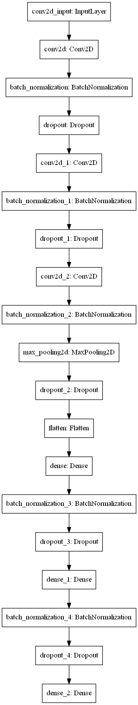

# Emotional state classifier
## Introduction to a problem
The task is to build a classifier on human emotional state via face expressions. What makes the task harder is that some images labeled to a wrong category.
## Data Description
Initial challenge and data can be found here: https://www.kaggle.com/c/3364.

The data used for this project was modified having one class less from initial challenge. The data consists of 48x48 pixel grayscale images of faces. The faces have been automatically registered so that the face is more or less centered and occupies about the same amount of space in each image. The task is to categorize each face based on the emotion shown in the facial expression in to one of six categories (Angry, Disgust, Fear, Happy, Sad, Surprise).

The project data can be found in project_data.csv which contains two columns, "emotion" and "pixels". The "emotion" column contains a numeric code ranging from 0 to 5, inclusive, for the emotion that is present in the image. The "pixels" column contains a string surrounded in quotes for each image. The contents of this string a space-separated pixel values in row major order.

## Methodology
For this project I build CNN with pyramide like structure where number of convolution filters and dense neurons increase towards the end.

Also the data was unbalanced so RandomOverSampler was used to even the classes.

Before oversampling: Counter({3: 7215, 4: 4830, 2: 4097, 0: 3995, 5: 3171, 1: 436})

After oversampling: Counter({0: 7215, 2: 7215, 4: 7215, 3: 7215, 5: 7215, 1: 7215})

## Conclusion 
The top solution on Kaggle is 70% but with one more emotion class, here we have modified data, but still results are promising 80% - accuracy on test data.
