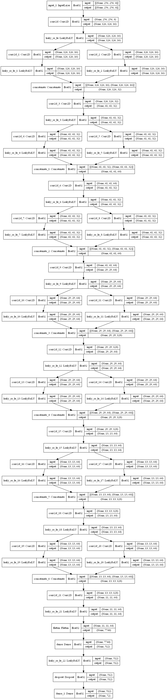

# Fine and Coarse Recognition project
## Introduction to a problem
The task is to build CNN wich would be efficient to classify buildings and food at the same time, which leads to fine and coarse recognition in one net.
## Data Description
The data consist of 72 classes of different images. 13 of them belongs to buildings, while other 59 to food. Some of data images have wrong labels wich amplify the challenge of the task.
## Methodology
Main idea was to build "chain" architecture of convolutional layers so that each of parts may extract features for buildings or food only.

## Conclusion
After extensive traning model got 90-95% top_5 accuracy and around 85% top_1 accuracy, which is good considering the dirtiness of data.
