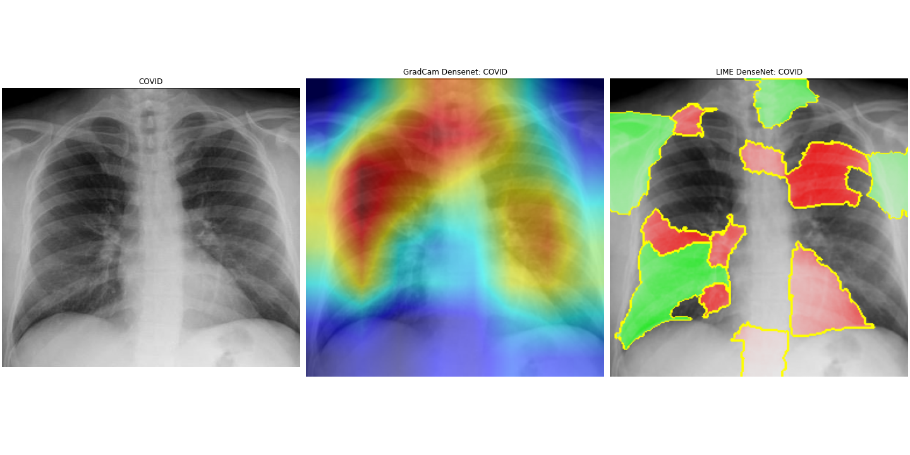
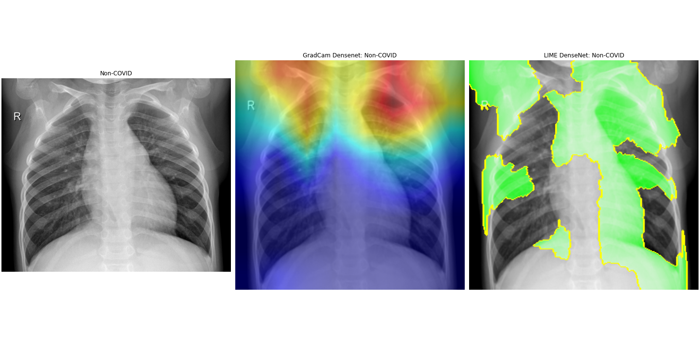

# Local AI explainability on medical images X-Ray chest COVID
## Introduction to a problem
The task is to use  explainability methods in the analysis of COVID X-Ray chest images to support medical professionals decesion making 
## Data Description
There are around 10 000 images distributed equaly between two classes: COVID and Non-COVID
## Methodology
Train deep learning model classifier with high target metrick on COVID X-Ray chest images

Apply explanation generation methods: Grad-CAM, LIME 

## Conclusion 
The preliminary results looks promising, but further work requires validation from medical professionals.
## Next Steps 
Collect feedback from medical professionals

 
Evaluate explainability methods and their interaction with models 

## Data Source
Link for downloading data: https://data.mendeley.com/datasets/8h65ywd2jr/3